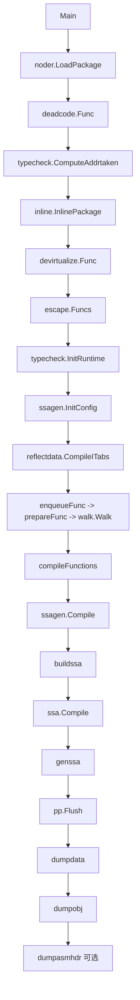

# Main 函数宏观管线分析（`src/cmd/compile/internal/gc/main.go`）

## 全局上下文
你现在是一个顶级的底层系统架构师和领域专家。我正在阅读相关源码。
我们的目标是：不仅要理清编译主干流程，还要提取领域模型，最终让我能自己写出类似的基础工具。
在接下来的对话中，我会按模块发给你特定的代码片段或文件路径。请你严格按照我要求的格式进行结构化输出，不要说废话。如果你明白你的角色和任务。

## 核心调用顺序（Call Tree）
1. `Main -> noder.LoadPackage`
2. `Main -> deadcode.Func -> typecheck.ComputeAddrtaken`
3. `Main -> inline.InlinePackage -> devirtualize.Func -> escape.Funcs`
4. `Main -> typecheck.InitRuntime -> ssagen.InitConfig -> reflectdata.CompileITabs`
5. `Main -> enqueueFunc -> prepareFunc -> walk.Walk`
6. `Main -> compileFunctions -> ssagen.Compile -> buildssa -> ssa.Compile -> genssa -> pp.Flush`
7. `Main -> dumpdata -> dumpobj -> dumpasmhdr(optional)`

## Mermaid 流程图

## Data Pipeline
| Function | Input | Output |
|---|---|---|
| `noder.LoadPackage` | `.go` 源码文本 + import 导出数据 | 已类型化包级 IR（`typecheck.Target`） |
| `deadcode.Func` | 已类型化函数 IR | 去除明显死代码的函数体 |
| `typecheck.ComputeAddrtaken` | 包级 IR 声明树 | 补齐变量 `Addrtaken` 标记 |
| `inline.InlinePackage` | 包级函数图 | 可内联函数被展开后的 IR |
| `devirtualize.Func` | 内联后的调用 IR | 一部分接口调用改写为直接调用 |
| `escape.Funcs` | 包级函数集合 | 逃逸结论（栈/堆、捕获策略） |
| `typecheck.InitRuntime` | runtime 声明表 | 编译器可用 runtime 符号 |
| `ssagen.InitConfig` | 架构与编译选项 | SSA 后端配置、缓存、helper 映射 |
| `reflectdata.CompileITabs` | itab 收集条目 | 接口方法实现映射条目 |
| `enqueueFunc/prepareFunc/walk.Walk` | 优化后函数 IR | walk 后低级 IR + 编译队列 |
| `compileFunctions` | 编译队列 | 并行调度到后端编译入口 |
| `ssagen.Compile/buildssa/ssa.Compile` | walk 后 IR | 优化+分配后 SSA |
| `genssa/pp.Flush` | SSA | 机器指令写入符号 text |
| `dumpdata/dumpobj` | text/data 符号与元数据 | `.o`/archive 对象产物 |

## 关键代码锚点
- `src/cmd/compile/internal/gc/main.go:55`
- `src/cmd/compile/internal/gc/main.go:192`
- `src/cmd/compile/internal/gc/main.go:205`
- `src/cmd/compile/internal/gc/main.go:215`
- `src/cmd/compile/internal/gc/main.go:229`
- `src/cmd/compile/internal/gc/main.go:253`
- `src/cmd/compile/internal/gc/main.go:266`
- `src/cmd/compile/internal/gc/main.go:273`
- `src/cmd/compile/internal/gc/main.go:281`
- `src/cmd/compile/internal/gc/main.go:287`
- `src/cmd/compile/internal/gc/main.go:305`
- `src/cmd/compile/internal/gc/main.go:307`
