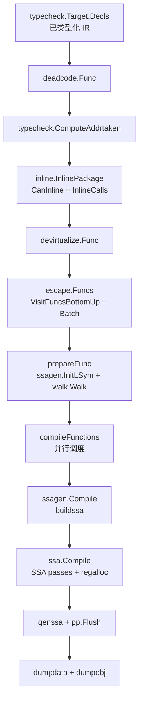
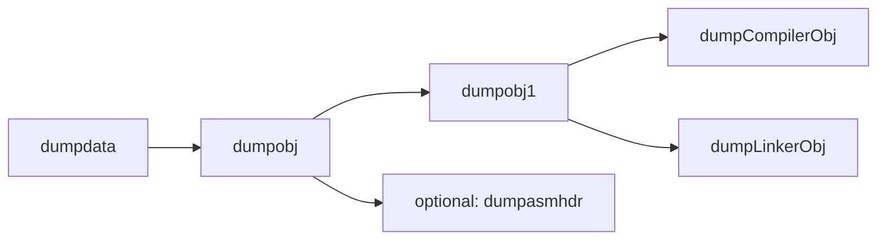
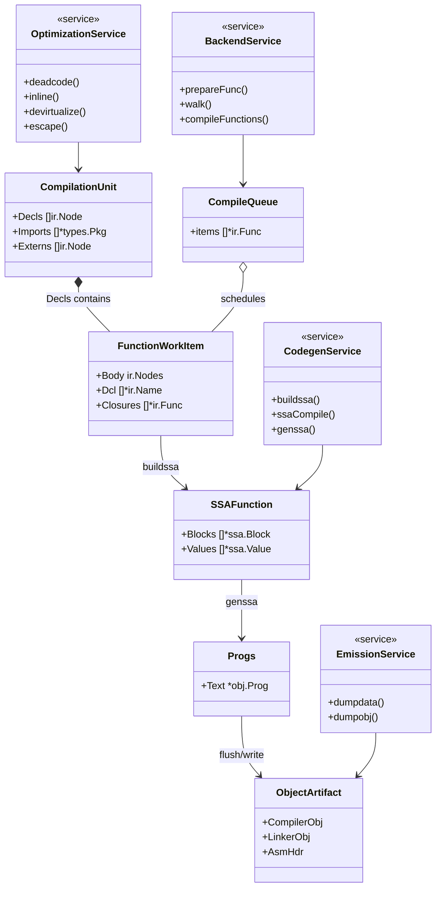

# Go 编译器 `gc.Main` 其他核心流程深挖（不含 `noder.LoadPackage`）

> 范围：`docs/go-compile-main-analysis/main-flow.md` 中除 `noder.LoadPackage` 之外的核心阶段。
> 目标：对剩余流程做一层下钻，抽取执行链、数据管道和可复用 DDD 模型。

## Core Flow

## 子流程 1：前端优化链

### 调用顺序

### Data Pipeline

| Function | Input | Output |
|---|---|---|
| `deadcode.Func` | 单个 `*ir.Func` 的已类型化 `Body` | 去掉常量分支导致的不可达语句；极端情况下归约为空块 |
| `typecheck.ComputeAddrtaken` | `top []ir.Node`（通常是 `typecheck.Target.Decls`） | 全量补齐 `ONAME.Addrtaken` 位（含 closure var 回写） |
| `inline.InlinePackage` | 全包函数图（`typecheck.Target.Decls`） | 标记可内联函数（`CanInline`）并在调用点展开（`InlineCalls`） |
| `devirtualize.Func` | 内联后的函数体 IR | 可静态确定的 `OCALLINTER` 改写为更直接调用形式 |
| `escape.Funcs` | 优化后的函数集合 | 逃逸结论（堆/栈分配、闭包捕获策略、参数泄漏标签） |
| `escape.Batch` | SCC/非递归函数批次 | 基于数据流图的跨函数逃逸求解结果 |

## 子流程 2：后端准备与函数调度链

### 调用顺序

### Data Pipeline

| Function | Input | Output |
|---|---|---|
| `typecheck.InitRuntime` | runtime 低层声明表 | 编译器内部可用的 runtime 函数/变量符号 |
| `ssagen.InitConfig` | 目标架构与编译开关 | SSA backend 配置、缓存、runtime helper 符号映射 |
| `reflectdata.CompileITabs` | 收集到的 `itabs` 条目 | 每个条目的方法函数符号列表（用于后续去虚调用/反射数据） |
| `enqueueFunc` | 顶层 `*ir.Func` | 过滤后入 `compilequeue`；触发 `prepareFunc` |
| `prepareFunc` | `*ir.Func` | 完成 `InitLSym`、参数布局、`walk.Walk` 前端降级 |
| `walk.Walk` | 类型化函数 IR | 更接近后端的低级 IR（显式 runtime 调用、顺序化副作用） |
| `compileFunctions` | `compilequeue` | 多 worker 调度调用 `ssagen.Compile`，并处理 closure 递归编译 |

## 子流程 3：SSA 到机器码链

### 调用顺序

### Data Pipeline

| Function | Input | Output |
|---|---|---|
| `ssagen.Compile` | 单个 `*ir.Func` | 单函数编译总控：SSA 构建 + 指令生成 + 汇编落地 |
| `buildssa` | `*ir.Func`（walk 后 IR） | `*ssa.Func`（CFG、值、ABI 参数布局、初始内存模型） |
| `ssa.Compile` | `*ssa.Func` | 优化后且已完成 regalloc 的目标相关 SSA |
| `genssa` | `*ssa.Func` + `*objw.Progs` | `obj.Prog` 序列（含 liveness、inline marks、安全点等） |
| `pp.Flush` | `obj.Prog` 序列 | 汇编结果写入函数符号文本段 |

## 子流程 4：对象产物输出链

### 调用顺序

### Data Pipeline

| Function | Input | Output |
|---|---|---|
| `dumpdata` | 已完成代码生成的符号与 `typecheck.Target` | 反射类型、itab/ptab、全局符号、GC locals、可能新增函数并回编译 |
| `dumpobj` | 输出模式配置（`-o/-linkobj`） | 选择单文件或 compiler/linker 拆分对象输出 |
| `dumpobj1` | 目标文件与模式 | `ar` 格式对象容器（`__.PKGDEF` / `_go_.o`） |
| `dumpCompilerObj` | 编译期导出信息 | binary export 数据区（供后续编译依赖） |
| `dumpLinkerObj` | linker 所需符号与可选 cgo pragma | 链接器对象数据（供 link 阶段） |
| `dumpasmhdr` | `typecheck.Target.Asms` | 汇编头文件宏定义 |

## DDD Model

### Bounded Context

1. Frontend Optimization Context
- 负责 IR 级语义保持优化（死代码、内联、去虚、逃逸）。

2. Backend Lowering Context
- 负责从高层 IR 到可 SSA 化 IR 的降级，以及并行编译任务编排。

3. Code Generation Context
- 负责 SSA 优化、寄存器分配、指令选择与汇编落地。

4. Artifact Emission Context
- 负责导出数据、链接对象、调试/汇编辅助产物写出。

### 聚合与实体

- Aggregate Root: `CompilationUnit`（对应 `typecheck.Target`）
- Entity: `FunctionWorkItem`（`*ir.Func`，贯穿 enqueue -> walk -> SSA -> machine code）
- Entity: `CompileQueue`（`compilequeue`）
- Entity: `SSAFunction`（`*ssa.Func`）
- Entity: `ObjectArtifact`（compiler obj / linker obj / asm header）

### 领域服务

- `deadcode`, `inline`, `devirtualize`, `escape`：优化域服务
- `walk`, `compileFunctions`, `ssagen.Compile`：降级与编排服务
- `ssa.Compile`, `genssa`：代码生成域服务
- `dumpdata`, `dumpobj*`：产物输出域服务

### 基础设施服务

- `objw`, `obj`, `bio`, `archive`：对象写出基础设施
- `base.Ctxt`：编译上下文与符号基础设施

## UML Class Diagram

## Design Review

1. 采用的模式
- Pipeline Pattern：阶段有序推进，便于性能计时与问题定位。
- Composite + Visitor：`ir.Node` 树与 `Visit/EditChildren` 支撑多 pass 复用。
- SCC Batch Analysis：`VisitFuncsBottomUp`（Tarjan 变体）支撑逃逸分析最小批次求解。
- Work Queue + Worker Pool：`compilequeue` + `-c` worker 并行编译。

2. 这样设计的原因
- 编译过程天然是“表示层级逐步降低”的流水线。
- 逃逸/内联等需要跨函数信息，但仍需控制分析范围与成本。
- 后端编译最耗时，必须并行化且保持每函数编译自治。

3. 如果我来设计
- 保留当前 Pipeline 主骨架。
- 把 `compilequeue` 抽象成显式任务对象（状态、依赖、重试标签），提升可观测性。
- 把 `dumpdata` 的“新增函数回编译循环”从函数体抽为独立阶段，提升可读性。

4. 优劣对比
- 现设计优势：路径短、性能高、历史稳定。
- 现设计代价：全局上下文较重，阶段耦合需要读源码才完整理解。
- 改造后优势：可测试性/可观测性更好。
- 改造后代价：抽象层增多，热路径可能有额外开销。

## Code Anchors

- `src/cmd/compile/internal/gc/main.go:203`
- `src/cmd/compile/internal/gc/main.go:215`
- `src/cmd/compile/internal/gc/main.go:229`
- `src/cmd/compile/internal/gc/main.go:235`
- `src/cmd/compile/internal/gc/main.go:253`
- `src/cmd/compile/internal/gc/main.go:266`
- `src/cmd/compile/internal/gc/main.go:273`
- `src/cmd/compile/internal/gc/main.go:281`
- `src/cmd/compile/internal/gc/main.go:287`
- `src/cmd/compile/internal/gc/main.go:305`
- `src/cmd/compile/internal/deadcode/deadcode.go:14`
- `src/cmd/compile/internal/typecheck/subr.go:107`
- `src/cmd/compile/internal/inline/inl.go:57`
- `src/cmd/compile/internal/inline/inl.go:525`
- `src/cmd/compile/internal/devirtualize/devirtualize.go:18`
- `src/cmd/compile/internal/escape/escape.go:1820`
- `src/cmd/compile/internal/escape/escape.go:209`
- `src/cmd/compile/internal/ir/scc.go:52`
- `src/cmd/compile/internal/gc/compile.go:30`
- `src/cmd/compile/internal/gc/compile.go:81`
- `src/cmd/compile/internal/walk/walk.go:24`
- `src/cmd/compile/internal/gc/compile.go:100`
- `src/cmd/compile/internal/gc/compile.go:153`
- `src/cmd/compile/internal/ssagen/pgen.go:164`
- `src/cmd/compile/internal/ssagen/ssa.go:399`
- `src/cmd/compile/internal/ssagen/ssa.go:642`
- `src/cmd/compile/internal/ssa/compile.go:29`
- `src/cmd/compile/internal/ssagen/ssa.go:6732`
- `src/cmd/compile/internal/ssagen/pgen.go:190`
- `src/cmd/compile/internal/gc/obj.go:109`
- `src/cmd/compile/internal/gc/obj.go:41`
- `src/cmd/compile/internal/gc/obj.go:50`
- `src/cmd/compile/internal/gc/obj.go:104`
- `src/cmd/compile/internal/gc/obj.go:169`
- `src/cmd/compile/internal/gc/export.go:48`
