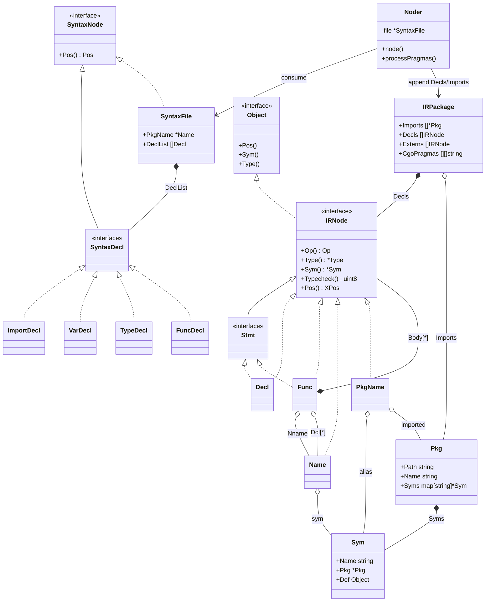

# `noder.LoadPackage` 阶段 DDD 模型提炼（Go 1.17）

## 1. 产出物分析

`noder.LoadPackage` 的核心目标是把源码文本转成可进入后续优化与代码生成阶段的“已类型化包级 IR 聚合”。

输入：
- 源码文件路径列表（`flag.Args()`）
- 已编译依赖包的导出数据（`.a/.o`）

处理中间形态：
1. `*.go` 文本 -> `syntax.File`（解析 AST）
2. `syntax` AST -> `ir.Node`（noder 降级）
3. `ir.Node` 经过分阶段 typecheck（top1/top2/func/externdcls）

最终输出：
- `typecheck.Target`（`*ir.Package`）
- 关键内容：
  - `Decls []ir.Node`：顶层声明（函数体已语义检查）
  - `Imports []*types.Pkg`：导入包元数据
  - `CgoPragmas`、`Externs` 等包级信息

## 2. 核心实体（领域对象）

聚合根：
- `ir.Package`：当前编译包的统一边界与载体。

核心接口：
- `ir.Node`：统一 IR 抽象，提供 `Op/Type/Sym/Typecheck/Pos` 等能力。

典型实体：
- `ir.Func`：函数声明与函数体实体（`Body/Dcl/ClosureVars/...`）。
- `ir.Name`：标识符实体，绑定符号、类型、存储类、定义点。
- `ir.Decl`：`const/type/var` 声明实体。
- `ir.PkgName`：`import` 绑定实体（别名、dot-import、中间状态）。
- `types.Pkg`：包级命名空间。
- `types.Sym`：符号表实体（绑定当前作用域对象）。

领域服务：
- `noder.LoadPackage`：编排 parse -> noder -> typecheck。
- `(*noder).node`：单文件 AST 到 IR 的翻译服务。
- `typecheck.*`：语义约束与类型规则服务。

基础设施服务：
- `importfile/openPackage/ReadImports`：导入包导出数据读取。

## 3. UML 类图（Mermaid）

## 4. 设计模式与思考

### 4.1 已采用的模式

1. 组合模式（Composite）
- `ir.Node` + 大量具体节点形成可遍历语法/语义树。
- 好处：统一承载不同语言结构，便于 pass 复用。

2. 访问者风格（Visitor-like Traversal）
- 通过 `DoChildren/Visit/EditChildren` 做分析与改写。
- 好处：把“遍历机制”和“具体变换逻辑”解耦。

3. 分阶段管线（Pipeline）
- parse -> node -> typecheck(top1/top2/func/...)。
- 好处：每阶段职责清晰，错误定位稳定。

4. 工厂/构造器模式
- `ir.New*` 系列构造器确保节点初始合法状态。

### 4.2 为什么这么设计

- 编译器需要处理异构语法结构，且要支持大量优化/改写 pass。
- 统一 `Node` 接口 + 阶段化处理，在可维护性与性能间取平衡。
- 导入处理与语义处理分层，便于兼容历史对象格式与构建系统。

### 4.3 如果由我设计（对比优劣）

我会保留当前主骨架（Composite + Visitor + Pipeline），但做两点收敛：
1. 减少全局可变状态：引入显式 `CompilationContext` 贯穿阶段。
2. 把导入读取抽象为接口仓储：弱化前端对对象格式细节的耦合。

对比：
- 现方案优势：路径短、执行快、工程历史稳定。
- 现方案不足：全局状态较多，测试隔离与并发推理复杂。
- 改造方案优势：可测试性、可组合性更好。
- 改造方案代价：抽象层增加，改造成本与运行时开销上升。

## 5. 关键代码锚点

- `src/cmd/compile/internal/noder/noder.go:29`
- `src/cmd/compile/internal/noder/noder.go:273`
- `src/cmd/compile/internal/noder/noder.go:341`
- `src/cmd/compile/internal/noder/import.go:179`
- `src/cmd/compile/internal/noder/import.go:450`
- `src/cmd/compile/internal/ir/node.go:20`
- `src/cmd/compile/internal/ir/package.go:10`
- `src/cmd/compile/internal/ir/func.go:50`
- `src/cmd/compile/internal/ir/name.go:37`
- `src/cmd/compile/internal/ir/name.go:500`
- `src/cmd/compile/internal/types/pkg.go:21`
- `src/cmd/compile/internal/types/sym.go:29`
- `src/cmd/compile/internal/syntax/nodes.go:10`
