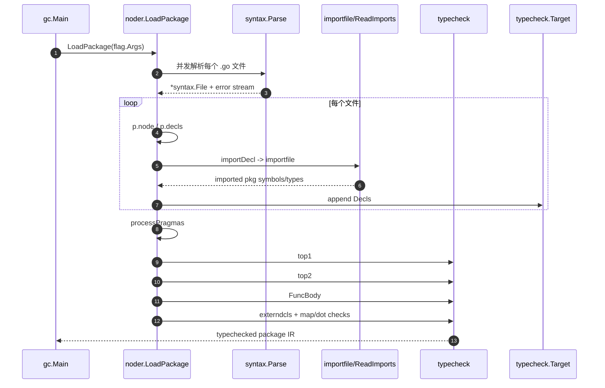

# 阶段 01 时序图：解析与类型检查

```mermaid
sequenceDiagram
    autonumber
    participant Main as gc.Main
    participant Noder as noder.LoadPackage
    participant Parser as syntax.Parse
    participant Importer as importfile/ReadImports
    participant TC as typecheck
    participant Target as typecheck.Target

    Main->>Noder: LoadPackage(flag.Args)
    Noder->>Parser: 并发解析每个 .go 文件
    Parser-->>Noder: *syntax.File + error stream
    loop 每个文件
        Noder->>Noder: p.node / p.decls
        Noder->>Importer: importDecl -> importfile
        Importer-->>Noder: imported pkg symbols/types
        Noder->>Target: append Decls
    end
    Noder->>Noder: processPragmas
    Noder->>TC: top1
    Noder->>TC: top2
    Noder->>TC: FuncBody
    Noder->>TC: externdcls + map/dot checks
    TC-->>Main: typechecked package IR
```
