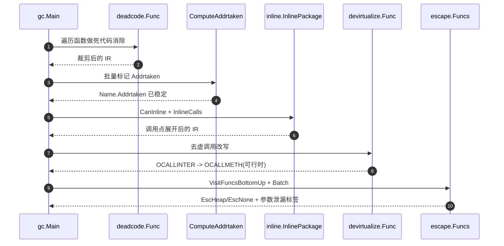

# 阶段 02 时序图：前端优化与语义变换

```mermaid
sequenceDiagram
    autonumber
    participant Main as gc.Main
    participant Dead as deadcode.Func
    participant Addr as ComputeAddrtaken
    participant Inl as inline.InlinePackage
    participant Dev as devirtualize.Func
    participant Esc as escape.Funcs

    Main->>Dead: 遍历函数做死代码消除
    Dead-->>Main: 裁剪后的 IR
    Main->>Addr: 批量标记 Addrtaken
    Addr-->>Main: Name.Addrtaken 已稳定
    Main->>Inl: CanInline + InlineCalls
    Inl-->>Main: 调用点展开后的 IR
    Main->>Dev: 去虚调用改写
    Dev-->>Main: OCALLINTER -> OCALLMETH(可行时)
    Main->>Esc: VisitFuncsBottomUp + Batch
    Esc-->>Main: EscHeap/EscNone + 参数泄漏标签
```
