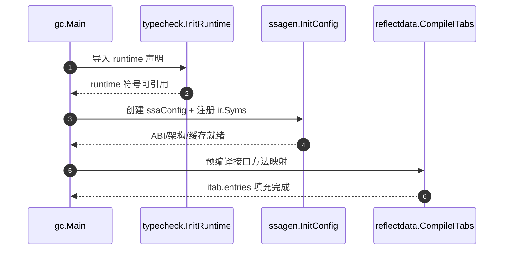

# 阶段 03 时序图：后端准备

```mermaid
sequenceDiagram
    autonumber
    participant Main as gc.Main
    participant TR as typecheck.InitRuntime
    participant CFG as ssagen.InitConfig
    participant ITab as reflectdata.CompileITabs

    Main->>TR: 导入 runtime 声明
    TR-->>Main: runtime 符号可引用
    Main->>CFG: 创建 ssaConfig + 注册 ir.Syms
    CFG-->>Main: ABI/架构/缓存就绪
    Main->>ITab: 预编译接口方法映射
    ITab-->>Main: itab.entries 填充完成
```
