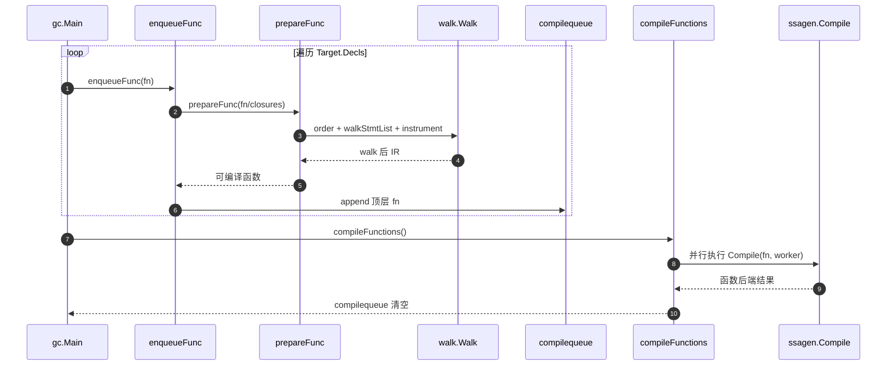

# 阶段 04 时序图：函数入队、降级与并行调度

```mermaid
sequenceDiagram
    autonumber
    participant Main as gc.Main
    participant Enq as enqueueFunc
    participant Prep as prepareFunc
    participant Walk as walk.Walk
    participant Q as compilequeue
    participant Comp as compileFunctions
    participant SSG as ssagen.Compile

    loop 遍历 Target.Decls
        Main->>Enq: enqueueFunc(fn)
        Enq->>Prep: prepareFunc(fn/closures)
        Prep->>Walk: order + walkStmtList + instrument
        Walk-->>Prep: walk 后 IR
        Prep-->>Enq: 可编译函数
        Enq->>Q: append 顶层 fn
    end
    Main->>Comp: compileFunctions()
    Comp->>SSG: 并行执行 Compile(fn, worker)
    SSG-->>Comp: 函数后端结果
    Comp-->>Main: compilequeue 清空
```
