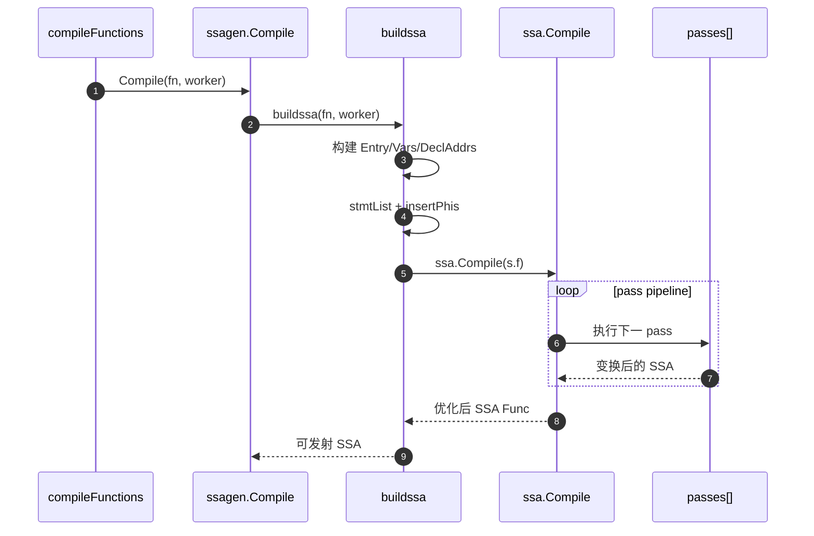

# 阶段 05 时序图：SSA 构建与优化

```mermaid
sequenceDiagram
    autonumber
    participant CF as compileFunctions
    participant SSG as ssagen.Compile
    participant B as buildssa
    participant SSA as ssa.Compile
    participant Pass as passes[]

    CF->>SSG: Compile(fn, worker)
    SSG->>B: buildssa(fn, worker)
    B->>B: 构建 Entry/Vars/DeclAddrs
    B->>B: stmtList + insertPhis
    B->>SSA: ssa.Compile(s.f)
    loop pass pipeline
        SSA->>Pass: 执行下一 pass
        Pass-->>SSA: 变换后的 SSA
    end
    SSA-->>B: 优化后 SSA Func
    B-->>SSG: 可发射 SSA
```
