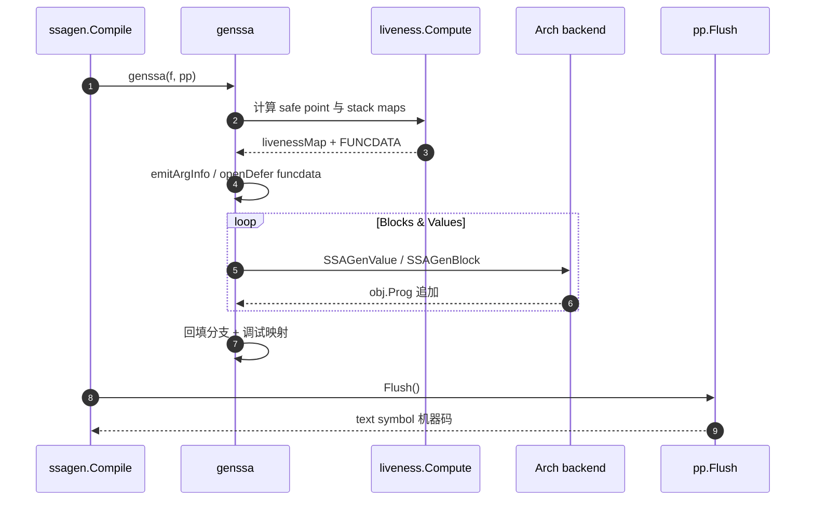

# 阶段 06 时序图：机器码生成

```mermaid
sequenceDiagram
    autonumber
    participant SSG as ssagen.Compile
    participant Gen as genssa
    participant Live as liveness.Compute
    participant Arch as Arch backend
    participant Asm as pp.Flush

    SSG->>Gen: genssa(f, pp)
    Gen->>Live: 计算 safe point 与 stack maps
    Live-->>Gen: livenessMap + FUNCDATA
    Gen->>Gen: emitArgInfo / openDefer funcdata
    loop Blocks & Values
        Gen->>Arch: SSAGenValue / SSAGenBlock
        Arch-->>Gen: obj.Prog 追加
    end
    Gen->>Gen: 回填分支 + 调试映射
    SSG->>Asm: Flush()
    Asm-->>SSG: text symbol 机器码
```
