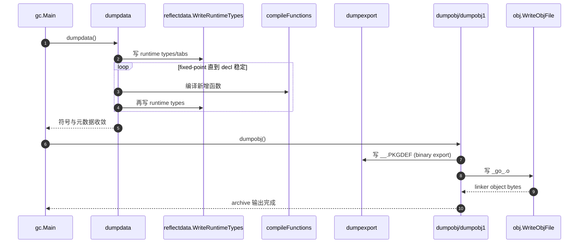

# 阶段 07 时序图：对象产物输出

```mermaid
sequenceDiagram
    autonumber
    participant Main as gc.Main
    participant Data as dumpdata
    participant Refl as reflectdata.WriteRuntimeTypes
    participant Comp as compileFunctions
    participant Exp as dumpexport
    participant Obj as dumpobj/dumpobj1
    participant Lnk as obj.WriteObjFile

    Main->>Data: dumpdata()
    Data->>Refl: 写 runtime types/tabs
    loop fixed-point 直到 decl 稳定
        Data->>Comp: 编译新增函数
        Data->>Refl: 再写 runtime types
    end
    Data-->>Main: 符号与元数据收敛
    Main->>Obj: dumpobj()
    Obj->>Exp: 写 __.PKGDEF (binary export)
    Obj->>Lnk: 写 _go_.o
    Lnk-->>Obj: linker object bytes
    Obj-->>Main: archive 输出完成
```
