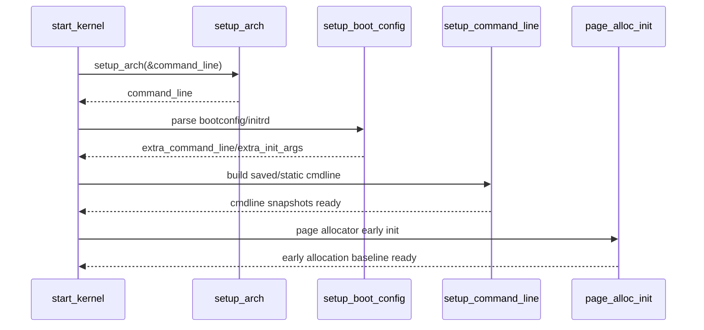

# Stage 01: 启动契约建立与命令行建模

## 1. 核心业务流程

### 该阶段主要工作
- 在 `start_kernel()` 起点建立“早期启动契约”：单核上下文 + 中断关闭 + 最小可信执行环境。
- 调用 `setup_arch()` 建立架构侧启动上下文，并获取 `command_line`。
- 调用 `setup_boot_config()` 从 initrd 抽取 bootconfig，并将 `kernel.*`、`init.*` 注入额外参数。
- 调用 `setup_command_line()` 生成“可追溯快照”和“可变解析副本”。

### 对源码做了哪些处理
- 将原始命令行与扩展命令行拼接成 `saved_command_line/static_command_line`。
- 通过 memblock 进行早期内存分配，避免常规分配器尚未就绪的风险。

### 详细调用链（函数级）
- `start_kernel`
- `setup_arch(&command_line)`
- `setup_boot_config(command_line)`
- `setup_command_line(command_line)`
- `build_all_zonelists(NULL)`
- `page_alloc_init()`

### 最终输出
- 启动参数双副本：`saved_command_line`（保存）与 `static_command_line`（解析）
- 早期内存分配基础状态就绪
- 后续参数解析与子系统初始化所需输入面稳定

## 2. 产出物分析

### 输入 -> 中间 -> 输出
- 输入：`boot_command_line`、boot params、initrd bootconfig
- 中间：`extra_command_line`、`extra_init_args`、`command_line`
- 输出：`saved_command_line`、`static_command_line`、分页分配前置状态

### 关键数据结构与核心字段
- `boot_command_line`：架构层填充后的原始命令行
- `saved_command_line`：用于 `/proc/cmdline` 等可观测面
- `static_command_line`：供 `parse_args` 原地修改
- `extra_init_args`：注入给用户态 init 的补充参数

## 3. 核心实体

### 最重要的 Interface
- `void __init setup_arch(char **cmdline_p)`

### 典型领域对象
- BootConfig（XBC 节点树）
- CommandLineSnapshot（保存态/解析态）
- MemblockAllocator（早期分配器）

### 角色分工
- 架构层：提供底层启动环境与初始 cmdline
- 通用入口层：统一拼装参数与初始化约束
- 早期分配层：支持启动期不可阻塞内存分配

## 4. 设计模式与思考

### 采用的模式
- `Template Method + Hook`

### 为什么这样设计
- `start_kernel` 提供跨架构一致主干，`setup_arch` 作为可覆写钩子注入平台差异，兼顾稳定性和可扩展性。

### 替代方案与优劣
- 替代：统一 `BootContext` 对象在单点完成解析与注入。
- 优点：接口单一、对象化更强。
- 缺点：削弱早期分阶段初始化灵活性，兼容现有架构代码成本高。

## 5. 阶段时序图

## 6. 代码锚点

- `init/main.c:848`
- `init/main.c:870`
- `init/main.c:871`
- `init/main.c:872`
- `init/main.c:616`
- `init/main.c:878`
- `init/main.c:879`
- `arch/x86/kernel/setup.c:771`
- `arch/x86/kernel/setup.c:905`
