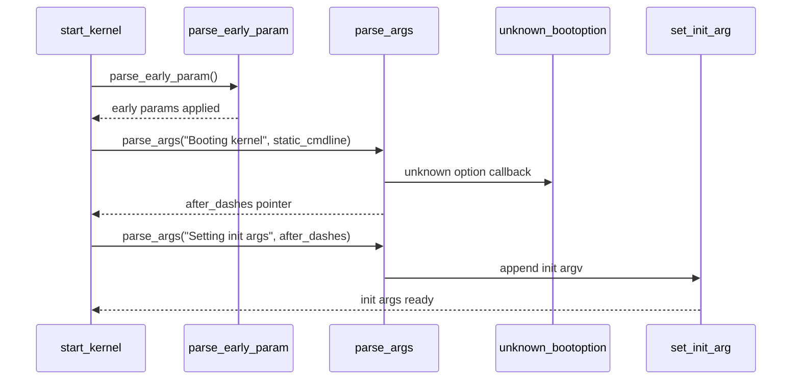

# Stage 02: 参数解析与策略注入

## 1. 核心业务流程

### 该阶段主要工作
- 完成 early 参数与常规参数的两阶段解析。
- 将未知参数按规则分流到 `argv_init` / `envp_init`，实现“内核参数”与“init 参数”并行承载。
- 处理 `init=`、`rdinit=` 等启动策略参数。

### 对源码做了哪些处理
- `parse_early_param()` 使用一次性防重入开关，保证 early 参数只被执行一次。
- `parse_args()` 遇到 `--` 时返回分隔后位置，后续参数由 `set_init_arg()` 直接附加给 init。
- `unknown_bootoption()` 将无法识别的参数转入 init 执行上下文。

### 详细调用链（函数级）
- `start_kernel`
- `parse_early_param()`
- `parse_args("Booting kernel", static_command_line, ...)`
- `parse_args("Setting init args", after_dashes, ...)`
- `unknown_bootoption()` / `set_init_arg()`

### 最终输出
- 内核参数已生效
- `argv_init` / `envp_init` 完整
- `execute_command` / `ramdisk_execute_command` 可用于后续 `kernel_init()` 执行策略

## 2. 产出物分析

### 输入 -> 中间 -> 输出
- 输入：`static_command_line`、参数注册区间、`--` 分隔符
- 中间：`param/val` token、unknown callback 分支
- 输出：内核配置生效 + init 参数集完成

### 关键数据结构与核心字段
- `parse_args(...)` 接口（支持 level 过滤和 unknown 回调）
- `argv_init[]` / `envp_init[]`
- `execute_command`（`init=`）
- `ramdisk_execute_command`（`rdinit=`）

## 3. 核心实体

### 最重要的 Interface
- `char *parse_args(const char *name, char *args, ... , int (*unknown)(...))`

### 典型领域对象
- 参数注册表（`struct kernel_param`）
- 早期参数注册（`struct obs_kernel_param`）
- init 执行参数容器（`argv_init/envp_init`）

### 角色分工
- 解析器：词法切分与派发
- 参数处理器：参数语义落地
- 兜底处理器：未知参数转交用户态 init

## 4. 设计模式与思考

### 采用的模式
- `Chain of Responsibility`

### 为什么这样设计
- 参数来源复杂、历史兼容负担大，链式派发可保持扩展与兼容并存。

### 替代方案与优劣
- 替代：schema 驱动统一解析。
- 优点：类型系统清晰、验证更强。
- 缺点：与现有宏注册和启动顺序耦合深，迁移成本高。

## 5. 阶段时序图

## 6. 代码锚点

- `init/main.c:750`
- `init/main.c:884`
- `init/main.c:885`
- `init/main.c:890`
- `init/main.c:531`
- `init/main.c:506`
- `init/main.c:575`
- `init/main.c:592`
- `include/linux/moduleparam.h:385`
- `kernel/params.c:161`
- `kernel/params.c:185`
