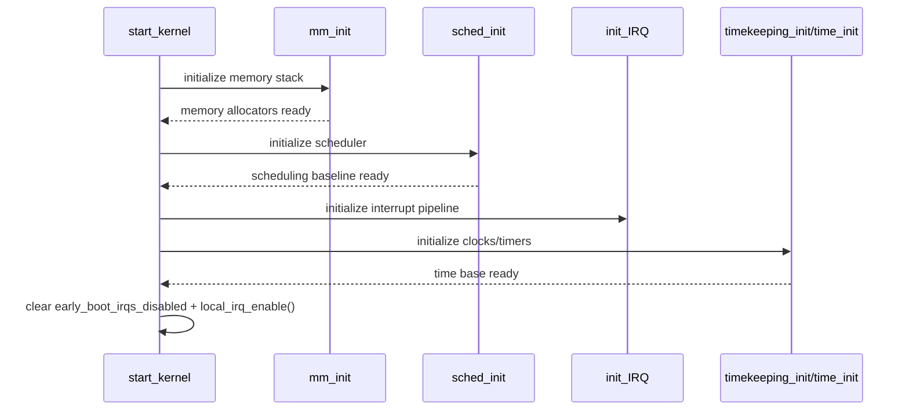

# Stage 03: 运行时骨架搭建（内存/调度/中断/时间）

## 1. 核心业务流程

### 该阶段主要工作
- 将系统从“仅能执行启动代码”推进到“可调度、可中断、可计时”的基础运行态。

### 对源码做了哪些处理
- 通过 `mm_init()` 完成关键内存子系统初始化（page allocator/slab/vmalloc 等）。
- 通过 `sched_init()` 建立最小可运行调度框架。
- 通过 `early_irq_init/init_IRQ/tick_init/timekeeping_init/time_init` 建立中断和时钟体系。
- 在条件满足后清除早期中断禁用标志并开启本地中断。

### 详细调用链（函数级）
- `trap_init()`
- `mm_init()`
- `sched_init()`
- `early_irq_init()` -> `init_IRQ()`
- `tick_init()` -> `timekeeping_init()` -> `time_init()`
- `local_irq_enable()`

### 最终输出
- 基础运行时骨架可用：内存管理、调度器、中断处理、时间基座全部可运行

## 2. 产出物分析

### 输入 -> 中间 -> 输出
- 输入：早期页表、memblock、CPU 启动状态
- 中间：内核内存对象缓存、IRQ 描述符、tick/hrtimer/timekeeper 状态
- 输出：并发事件处理能力和调度能力可用

### 关键数据结构与核心字段
- `early_boot_irqs_disabled`
- `system_state`（后续阶段推进）
- 内存与中断子系统全局状态对象（隐式）

## 3. 核心实体

### 最重要的 Interface
- `mm_init()`
- `sched_init()`
- `init_IRQ()`
- `time_init()`

### 典型领域对象
- 内存分配体系（buddy/slab/vmalloc）
- 调度运行队列
- IRQ 描述符与时钟管理结构

### 角色分工
- 内存层提供对象与页分配
- 调度层分配执行权
- 中断/时间层提供事件驱动和时间基准

## 4. 设计模式与思考

### 采用的模式
- `Phased Bootstrap + Barrier`

### 为什么这样设计
- 开中断是阶段屏障。必须先保证中断处理链和调度骨架有效，避免早期并发失控。

### 替代方案与优劣
- 替代：更激进的并行初始化。
- 优点：可缩短启动时间。
- 缺点：早期依赖图复杂，竞态和可观测性问题显著增加。

## 5. 阶段时序图

## 6. 代码锚点

- `init/main.c:903`
- `init/main.c:904`
- `init/main.c:916`
- `init/main.c:950`
- `init/main.c:951`
- `init/main.c:952`
- `init/main.c:957`
- `init/main.c:972`
- `init/main.c:978`
- `init/main.c:979`
- `init/main.c:821`
