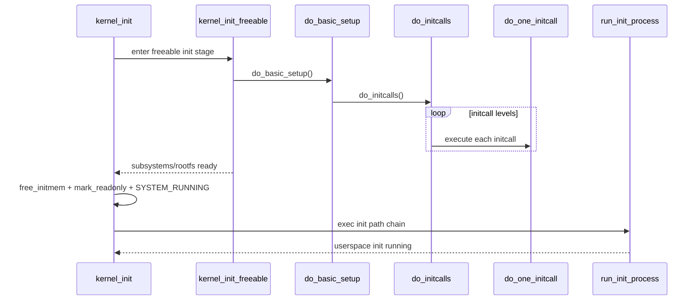

# Stage 05: initcall 收敛到用户态 init

## 1. 核心业务流程

### 该阶段主要工作
- 在 PID1 路径中完成 SMP 后续、驱动/子系统初始化、rootfs 准备。
- 回收 `__init` 内存并收敛内核权限状态，最终执行用户态 init 进程。

### 对源码做了哪些处理
- `kernel_init_freeable()` 等待 `kthreadd_done` 后执行 `do_pre_smp_initcalls()`、`smp_init()`、`do_basic_setup()`。
- `do_basic_setup()` 内部触发 `do_initcalls()`，按 level 遍历链接期注册的 initcall 表。
- `kernel_init()` 末期执行 `free_initmem()`、`mark_readonly()`、`pti_finalize()`，状态切到 `SYSTEM_RUNNING`。
- 按优先级尝试 `ramdisk_execute_command`、`execute_command`、默认 init 路径。

### 详细调用链（函数级）
- `kernel_init()`
- `kernel_init_freeable()`
- `do_pre_smp_initcalls()`
- `do_basic_setup()`
- `do_initcalls()`
- `do_initcall_level()`
- `do_one_initcall()`
- `run_init_process()/try_to_run_init_process()`

### 最终输出
- 全量内建初始化完成
- 系统状态进入 `SYSTEM_RUNNING`
- 成功 `exec` 用户态 init（如 `/sbin/init`）

## 2. 产出物分析

### 输入 -> 中间 -> 输出
- 输入：`kthreadd_done`、initcall section、`saved_command_line`、init 执行策略参数
- 中间：按等级执行的 initcall 队列、rootfs 就绪、完整安全态
- 输出：用户空间 1 号进程启动，内核进入常态运行

### 关键数据结构与核心字段
- `initcall_levels[]`
- `__initcall_start ... __initcall_end`
- `initcall_level_names[]`
- `ramdisk_execute_command` / `execute_command`

## 3. 核心实体

### 最重要的 Interface
- `do_one_initcall(initcall_t fn)`
- `run_init_process(const char *init_filename)`

### 典型领域对象
- Linker section registry（initcall 注册表）
- PID1 执行上下文
- rootfs namespace

### 角色分工
- 链接脚本：聚合 initcall 指针
- 运行时框架：分级调度并执行 initcall
- PID1：完成最终系统状态切换并进入用户态

## 4. 设计模式与思考

### 采用的模式
- `Plugin Registry (Linker Section) + Ordered Pipeline`

### 为什么这样设计
- 让“初始化函数定义位置”和“执行阶段顺序”解耦，适配大规模内建组件。

### 替代方案与优劣
- 替代：集中静态初始化列表。
- 优点：表面可读性更强。
- 缺点：扩展性差、链接裁剪能力弱，跨目录维护成本高。

## 5. 阶段时序图

## 6. 代码锚点

- `init/main.c:1411`
- `init/main.c:1493`
- `init/main.c:1498`
- `init/main.c:1517`
- `init/main.c:1528`
- `init/main.c:1293`
- `init/main.c:1278`
- `init/main.c:1207`
- `init/main.c:1430`
- `init/main.c:1437`
- `init/main.c:1451`
- `init/main.c:1468`
- `include/linux/init.h:200`
- `include/asm-generic/vmlinux.lds.h:926`
