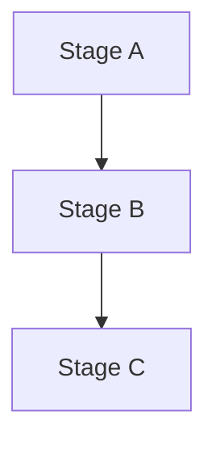

# Macro Pipeline Template

## 核心调用顺序
- Stage A -> Stage B -> Stage C

## Mermaid 流程图

```mermaid
flowchart TD
  A[Stage A] --> B[Stage B]
  B --> C[Stage C]
```

## Data Pipeline

| Function | Input | Output |
|---|---|---|
| `fnA` | ... | ... |
| `fnB` | ... | ... |
