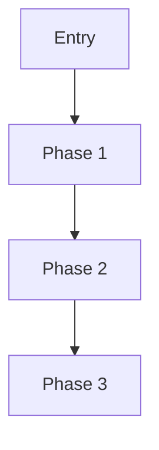
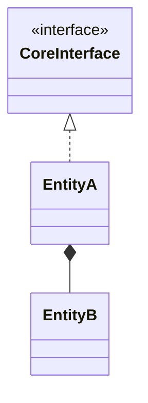

# Output Template

Use this template when the user does not define a custom format.

## Core Flow

## Data Pipeline

| Function | Input | Output |
|---|---|---|
| `fnA` | ... | ... |
| `fnB` | ... | ... |

## DDD Model

- Aggregate root: ...
- Entities: ...
- Value objects: ...
- Domain services: ...
- Infrastructure services: ...

## UML Class Diagram

## Design Review

- Patterns: ...
- Why: ...
- Alternative: ...
- Trade-offs: ...

## Code Anchors

- `path/to/file.go:123`
- `path/to/file.go:456`
